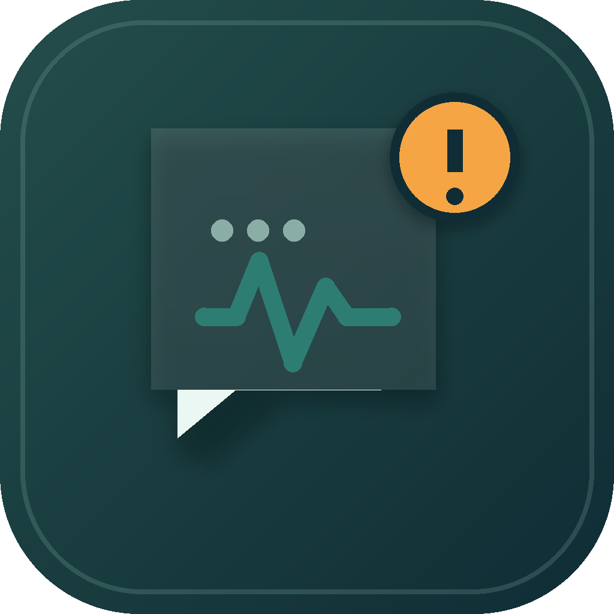

<div align="center">



# PingNest · 消息巢

**本地优先的 Windows 微信通知中心**

把重要的微信消息带到桌面，用更少的打扰，换来更清晰的工作节奏。

[](CHANGELOG.md)
[]()
[](#许可)

[下载安装包](../../releases) · [完整自述文档](PingNest-自述文档.docx) · [更新日志](CHANGELOG.md) · [问题反馈](../../issues)

</div>

---

> PingNest 面向个人本地使用，不属于微信官方客户端，也不提供微信官方接口。项目通过 Windows 原生能力读取本机微信数据，实际可用性取决于微信版本、安装方式和系统权限。

## 这是什么

PingNest 监听本机微信的新消息，在桌面弹出可高度自定义的通知卡片，并把每一条通知整理进本地通知中心。它适合在工作、学习或全屏应用期间快速掌握微信消息，而不必反复切换微信窗口。

2.0 是一次推倒重来：全新的「奶油工作台」界面、九套风格迥异的通知样式、四套可切换的全局动效，底层则迁移到 SQLite 本地存储并新增原生数据库监控通道。

## 亮点速览

| | |
| --- | --- |
| 🎨 **九套通知样式** | 潮汐 / 终端 / 信笺 / 霓虹弧光 / 音轨 / 蜂巢 / 卷轴 / 呼吸圆环 / 灵动胶囊，各有独立的入场与退场编排 |
| 🪟 **同屏堆叠队列** | 1–6 张卡片同屏，超出时最旧的先退场；蜂巢样式堆叠时拼成整片蜂窝 |
| 🖥 **奶油工作台** | 淡奶油绿 × 墨绿信号色，侧栏滑行胶囊、Bento 数据主页、Ctrl+K 命令面板 |
| 🌗 **四套动效** | 绸缎 / 水滴 / 墨锋 / 漂浮，全局节奏一键切换；跟随系统深浅色模式 |
| 🔇 **静音规则** | 按会话或关键词组合条件，支持三种作用范围，被静音的消息只入历史 |
| 🗂 **本地通知中心** | SQLite 存储 + 逐行加密，搜索、筛选、回看，数据不出本机 |
| ⚡ **实时监控** | 原生数据库监控管道即时推送变更，轮询常驻兜底，空闲自动降频 |
| 🔒 **完整性校验** | 原生库 SHA256 清单逐一校验，被替换或损坏的 DLL 拒绝加载 |

## 快速开始

1. 从 [Releases](../../releases) 下载 `PingNest-Setup.exe` 并安装（Windows 10/11 x64，需桌面版微信）。
2. 首次连接：先点击 PingNest 的 **「开始连接」**，再点击微信的 **「登录」**——顺序很重要。
3. 连接成功后进入工作台，消息监听自动启动；关闭窗口后应用驻留托盘继续工作。

<details>
<summary>从源码运行</summary>

```bash
git clone https://github.com/BeiChen-CN/PingNest.git
cd PingNest
npm install        # 自动生成原生库完整性清单
npm run dev        # 启动开发环境（Windows x64）
```

```bash
npm run typecheck  # 类型检查
npm test           # 自动化测试（88 项）
npm run build      # 构建 Windows 安装包 → release/
```

</details>

## 文档

完整的介绍、样式图解、连接指引、架构与隐私说明，见 **[PingNest-自述文档.docx](PingNest-自述文档.docx)**；逐版本变更见 [CHANGELOG.md](CHANGELOG.md)。

## 数据与隐私

本地优先，无云端、无遥测：通知历史保存在本机 SQLite 数据库（支持时逐行加密），微信密钥经系统凭据加密保存；唯一的运行期外联点是联系人头像图片经由微信 CDN 加载。删除历史或移除连接前，请确认不再需要对应的本地数据。

## 许可

[CC BY-NC-SA 4.0](LICENSE) —— 个人学习与日常使用自由；商业使用需另行授权；改编再分发须以相同许可共享并署名。npm 依赖许可清单随安装包附带，原生组件许可见 `third_party/licenses/`。

## 致谢

感谢 [WeFlow](https://github.com/hicccc77/WeFlow) 提供思路与代码参考。
